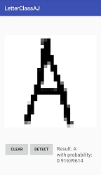

# AndroidLetterClassification
Tensorflow + Android Letter Classification

# How to Generate PB file
Android need .pb file from Tensorflow and to be put inside assert folder
To generate pb file take a look at Python folder

First, download letter dataset from http://yaroslavvb.com/upload/notMNIST/notMNIST_small.tar.gz

next, extract and put dataset inside "notMNIST_small" folder or you can change folder destination inside LetterDataset.py

then, run cnn - letter.py, it will generate "out" folder, u only need "optimized_letter_convnet.pb" file

# Refference
Thanks to this people,

https://github.com/miyosuda/TensorFlowAndroidMNIST

https://github.com/mari-linhares/mnist-android-tensorflow

https://github.com/Piasy

http://enakai00.hatenablog.com/entry/2016/08/02/102917
